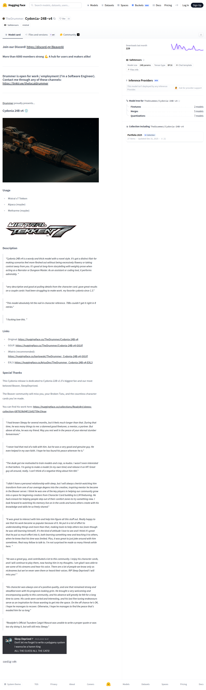
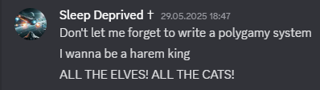

# Visited: https://huggingface.co/TheDrummer/Cydonia-24B-v4
**Time:** Thu May  7 17:51:11 UTC 2026

## Screenshot

## Raw HTML
[page.html](./page.html)

## Downloaded Media (4 files)
## Downloaded Media Files

## Other Links
- [#cydonia-24b-v4-💿](#cydonia-24b-v4-💿)
- [#description](#description)
- [#drummer-is-open-for-work--employment-im-a-software-engineer-contact-me-through-any-of-these-channels-httpslinktreethelocaldrummer](#drummer-is-open-for-work--employment-im-a-software-engineer-contact-me-through-any-of-these-channels-httpslinktreethelocaldrummer)
- [#join-our-discord-httpsdiscordggbeaverai](#join-our-discord-httpsdiscordggbeaverai)
- [#links](#links)
- [#more-than-6000-members-strong-💪-a-hub-for-users-and-makers-alike](#more-than-6000-members-strong-💪-a-hub-for-users-and-makers-alike)
- [#special-thanks](#special-thanks)
- [#usage](#usage)
- [/](/)
- [/TheDrummer](/TheDrummer)
- [/TheDrummer/Cydonia-24B-v4](/TheDrummer/Cydonia-24B-v4)
- [/TheDrummer/Cydonia-24B-v4/discussions](/TheDrummer/Cydonia-24B-v4/discussions)
- [/TheDrummer/Cydonia-24B-v4/tree/main](/TheDrummer/Cydonia-24B-v4/tree/main)
- [/collections/TheDrummer/portfolio-2025](/collections/TheDrummer/portfolio-2025)
- [/datasets](/datasets)
- [/docs](/docs)
- [/docs/hub/model-cards#specifying-a-base-model](/docs/hub/model-cards#specifying-a-base-model)
- [/enterprise](/enterprise)
- [/front/build/kube-87b6ff9/style.css](/front/build/kube-87b6ff9/style.css)
- [/huggingface](/huggingface)
- [/join](/join)
- [/js/script.js](/js/script.js)
- [/login](/login)
- [/models](/models)
- [/models?library=safetensors](/models?library=safetensors)
- [/models?other=base_model:finetune:TheDrummer/Cydonia-24B-v4](/models?other=base_model:finetune:TheDrummer/Cydonia-24B-v4)
- [/models?other=base_model:merge:TheDrummer/Cydonia-24B-v4](/models?other=base_model:merge:TheDrummer/Cydonia-24B-v4)
- [/models?other=base_model:quantized:TheDrummer/Cydonia-24B-v4](/models?other=base_model:quantized:TheDrummer/Cydonia-24B-v4)
- [/models?other=mistral](/models?other=mistral)
- [/pricing](/pricing)
- [/privacy](/privacy)
- [/spaces](/spaces)
- [/spaces/huggingface/InferenceSupport/discussions/new?title=TheDrummer/Cydonia-24B-v4&amp;description=React%20to%20this%20comment%20with%20an%20emoji%20to%20vote%20for%20%5BTheDrummer%2FCydonia-24B-v4%5D(%2FTheDrummer%2FCydonia-24B-v4)%20to%20be%20supported%20by%20Inference%20Providers.%0A%0A(optional)%20Which%20providers%20are%20you%20interested%20in%3F%20(Novita%2C%20Hyperbolic%2C%20Together%E2%80%A6)%0A](/spaces/huggingface/InferenceSupport/discussions/new?title=TheDrummer/Cydonia-24B-v4&amp;description=React%20to%20this%20comment%20with%20an%20emoji%20to%20vote%20for%20%5BTheDrummer%2FCydonia-24B-v4%5D(%2FTheDrummer%2FCydonia-24B-v4)%20to%20be%20supported%20by%20Inference%20Providers.%0A%0A(optional)%20Which%20providers%20are%20you%20interested%20in%3F%20(Novita%2C%20Hyperbolic%2C%20Together%E2%80%A6)%0A)
- [/storage](/storage)
- [/terms-of-service](/terms-of-service)
- [https://apply.workable.com/huggingface/](https://apply.workable.com/huggingface/)
- [https://cdnjs.cloudflare.com/ajax/libs/KaTeX/0.12.0/katex.min.css](https://cdnjs.cloudflare.com/ajax/libs/KaTeX/0.12.0/katex.min.css)
- [https://de5282c3ca0c.edge.sdk.awswaf.com/de5282c3ca0c/526cf06acb0d/challenge.js](https://de5282c3ca0c.edge.sdk.awswaf.com/de5282c3ca0c/526cf06acb0d/challenge.js)
- [https://discord.gg/BeaverAI](https://discord.gg/BeaverAI)
- [https://fonts.googleapis.com/css2?family=IBM+Plex+Mono:wght@400;600;700&display=swap](https://fonts.googleapis.com/css2?family=IBM+Plex+Mono:wght@400;600;700&display=swap)
- [https://fonts.googleapis.com/css2?family=Source+Sans+Pro:ital,wght@0,200;0,300;0,400;0,600;0,700;1,200;1,300;1,400;1,600;1,700&display=swap](https://fonts.googleapis.com/css2?family=Source+Sans+Pro:ital,wght@0,200;0,300;0,400;0,600;0,700;1,200;1,300;1,400;1,600;1,700&display=swap)
- [https://fonts.gstatic.com](https://fonts.gstatic.com)
- [https://huggingface.co/ArtusDev/TheDrummer_Cydonia-24B-v4-EXL3](https://huggingface.co/ArtusDev/TheDrummer_Cydonia-24B-v4-EXL3)
- [https://huggingface.co/TheDrummer](https://huggingface.co/TheDrummer)
- [https://huggingface.co/TheDrummer/Cydonia-24B-v4](https://huggingface.co/TheDrummer/Cydonia-24B-v4)
- [https://huggingface.co/TheDrummer/Cydonia-24B-v4-GGUF](https://huggingface.co/TheDrummer/Cydonia-24B-v4-GGUF)
- [https://huggingface.co/bartowski/TheDrummer_Cydonia-24B-v4-GGUF](https://huggingface.co/bartowski/TheDrummer_Cydonia-24B-v4-GGUF)
- [https://huggingface.co/collections/ReadyArt/sleeps-collection-687819b94f11b92759e10eae](https://huggingface.co/collections/ReadyArt/sleeps-collection-687819b94f11b92759e10eae)
- [https://huggingface.co/docs/inference-providers](https://huggingface.co/docs/inference-providers)
- [https://huggingface.co/docs/safetensors](https://huggingface.co/docs/safetensors)

## Stats
- Links: 56
- Media: 4
